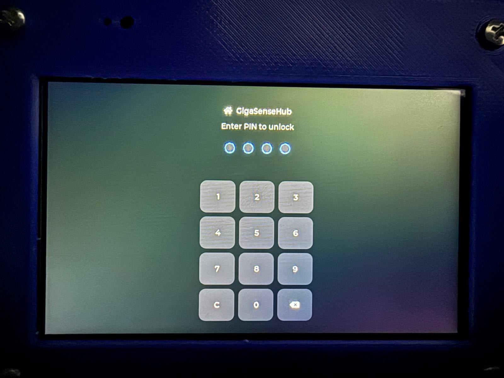
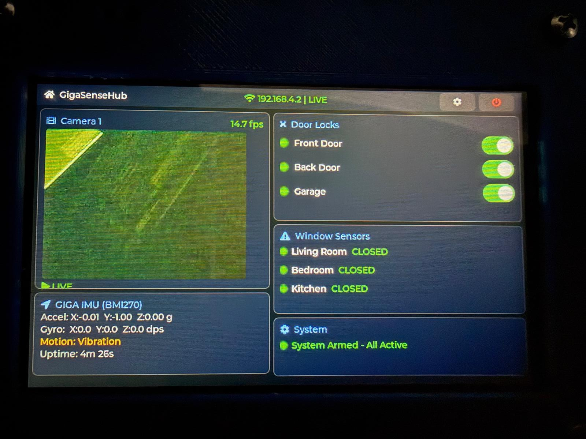
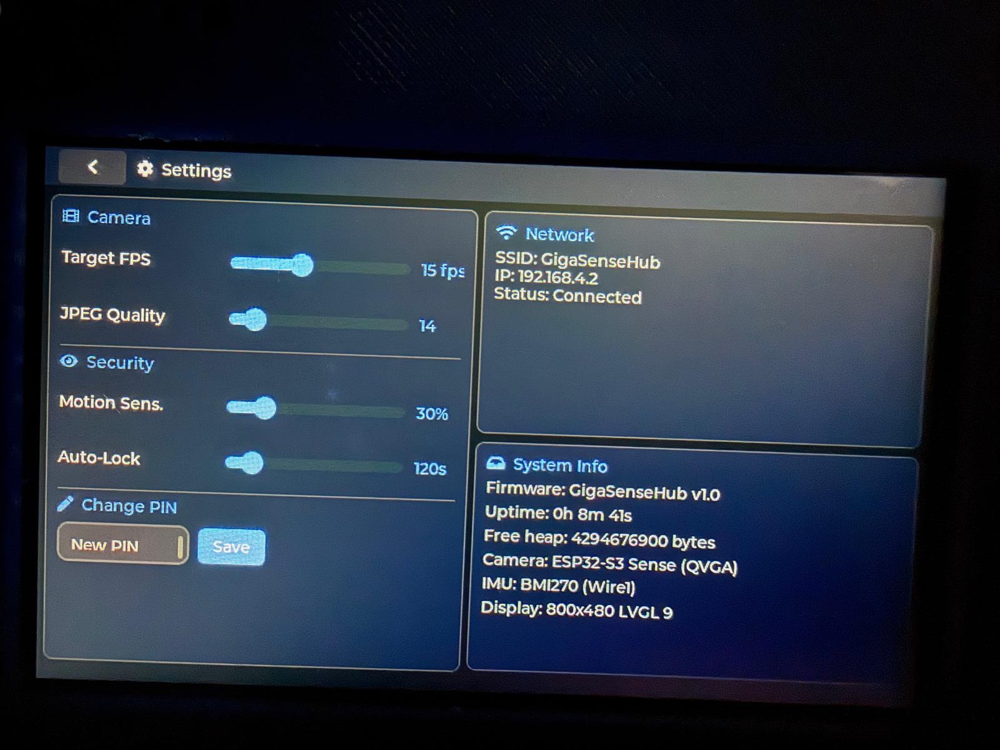

# GigaSenseHub

Wireless home security dashboard — ESP32-S3 camera streams live video to an Arduino GIGA R1 running a professional LVGL 9 touchscreen UI.

<p align="center">
  
  
  
</p>

## How It Works

```
ESP32-S3 Sense (Camera)          GIGA R1 + Display Shield (Hub)
┌────────────────────┐   WiFi   ┌────────────────────────────┐
│  OV2640 Camera     │◄────────│  800x480 Touch LCD          │
│  WiFi Access Point │         │  LVGL 9 UI + JPEG Decode    │
│  MJPEG @ 320x240   │────────►│  BMI270 IMU + Motion Detect │
└────────────────────┘ /stream └────────────────────────────┘
```

## Pages

| Page | Description |
|------|-------------|
| **Login** | 4-digit PIN numpad (default: `1234`) with dot indicators and error feedback |
| **Dashboard** | Live camera, door locks (3 switches), window sensors, IMU data, motion alerts |
| **Settings** | Camera FPS/quality, motion sensitivity, auto-lock timeout, PIN change, system info |

## Hardware

| Board | Role |
|-------|------|
| [Arduino GIGA R1 WiFi](https://store.arduino.cc/products/giga-r1-wifi) + [Display Shield](https://store.arduino.cc/products/giga-display-shield) | Security dashboard hub |
| [XIAO ESP32-S3 Sense](https://wiki.seeedstudio.com/xiao_esp32s3_getting_started/) | Wireless camera node |

No wiring between boards — WiFi only. USB power each.

## Quick Start

```bash
# Flash camera node
cd esp32-sensor-node
pio run -t upload

# Flash display hub (double-tap reset button first)
cd giga-display-hub
pio run -t upload
```

Power both boards. The GIGA connects to the ESP32's AP automatically. Enter PIN `1234` to unlock.

## Project Structure

```
├── esp32-sensor-node/       # Camera firmware (WiFi AP + MJPEG stream)
├── giga-display-hub/        # Dashboard firmware (LVGL 9 + JPEG decode + IMU)
├── shared/protocol.h        # Network config shared by both boards
└── assets/                  # Screenshots
```

## Network

| Setting | Value |
|---------|-------|
| SSID | `GigaSenseHub` |
| Password | `sensehub32` |
| Stream | `http://192.168.4.1/stream` |

## Key Technical Details

- **Video**: TJpgDec decodes MJPEG into SDRAM-backed RGB565 buffer displayed via `lv_image`
- **IMU**: BMI270 on `Wire1` (Wire is used by GT911 touch controller)
- **Auto-lock**: Uses LVGL's inactivity timer, unaffected by network blocking calls
- **Display**: 480x800 portrait panel, LVGL handles 270-degree rotation to 800x480 landscape

## Dependencies

| ESP32 | GIGA |
|-------|------|
| ESP32 Camera Driver | LVGL 9.5 |
| WebServer | Arduino_H7_Video |
| | Arduino_GigaDisplayTouch |
| | Arduino_BMI270_BMM150 |
| | TJpgDec (vendored) |

## Performance

| Metric | Value |
|--------|-------|
| Video | 10-15 fps @ QVGA |
| IMU | 20 Hz |
| RAM | 45% |
| Flash | 69% |

## License

MIT
